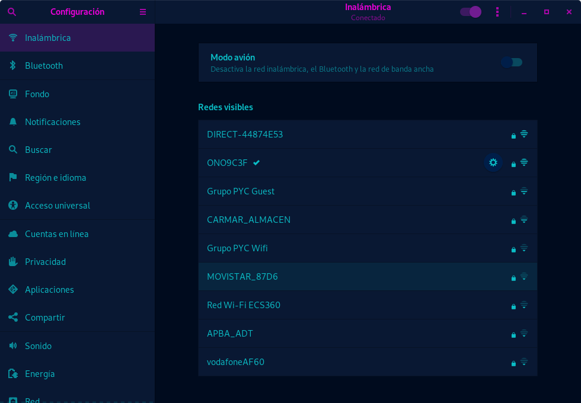

<h1>Instalar drivers Realtek rtl8821ce</h1>

Al parecer Realtek todavía no se ha dignado a sacar los drivers para linux para la tarjeta de red rtl8821ce y tampoco ha abierto el código para que sea la propia comunidad la que cree los drivers, así que de nuevo al actualizar el kernel de linux, tonto de mi, me olvidé de este pequeño detalle. 

Vamos a hacer un breve repaso de como instalar los drivers. A continuación explicaré dos maneras diferentes y diré cual es la que he escogido yo, al menos por el momento.

 
<h2>Repositorio linux</h2>

En el siguiente repositorio podemos encontrar un sinfin de parches y drivers para linux, entre ellos, algunos para la rtl8821ce. Pongo directamente la dirección del repositorio de los archivos que necesitamos.

            https://github.com/endlessm/linux/tree/master/drivers/net/wireless/rtl8821ce

Una vez descargada la carpeta, nos metemos dentro y modificamos el archvio Makefile.

<pre>[sinsentido@sinhost ~]$ cd rtl8821ce/
[sinsentido@sinhost rtl8821ce]$ sudo nano Makefile 
</pre>

Dentro del archivo tenemos que buscar: 

            export TopDIR ?= $(srctree)/$(src)

Y sustituir $(srctree)/$(src) por la ruta donde tenemos nuestra carpeta con los driver. En mi caso sería:

            export TopDIR ?= /home/sinsentido/rtl8821ce

Una vez hecho esto solo tenemos que ejecutar el make desde dentro de la carpeta de la siguiente manera:

<pre>[sinsentido@sinhost rtl8821ce]$ sudo make
[sinsentido@sinhost rtl8821ce]$ sudo make install
[sinsentido@sinhost rtl8821ce]$ sudo modprobe -a 8821ce
</pre>

Utilizamos modprobe -a para agregar el modulo al kernel.

Esta manera de hacerlo es la más común y la más indicada si estas utilizando un sistema operativo como Fedora. Pero yo no he conseguido hacerlo funcionar. He tenido problemas con el make y he decidido probar otra solución que de momento me ha servido y que explico a continuación.

 
<h2>Repositorio de tomaspinho</h2>

El siguiente repositorio también contiene drivers para la rtl8821ce, para kernel con una version superior a la 4.14 y para distribuciones Arch y Ubuntu 18.10. Aunque a mi me ha funcionado bastante bien en Fedora, no puedo asegurar que pueda funcionar en otras distribuciones o versiones diferentes (actualmente estoy usando la 30).

¡Importante! Para realizar los siguientes pasos debemos de tener instalado dkms. Si no lo tienes instalado puedes hacerlo con el siguiente comando: 

<pre>[sinsentido@sinhost rtl8821ce]$ sudo dnf install dkms
</pre>

Vale, el primer paso es descargar el repositorio y clonarlo en nuestro equipo.

            https://github.com/tomaspinho/rtl8821ce

Una vez descargado nos metemos en el directorio y otorgamos permisos de ejecución a los scripts de instalación y desisntalación.

<pre>[sinsentido@sinhost ~]$ cd rtl8821ce/
[sinsentido@sinhost rtl8821ce]$ sudo chmod +x dkms-install.sh 
[sinsentido@sinhost rtl8821ce]$ sudo chmod +x dkms-remove.sh 
</pre>

Ahora solo tenemos que ejecutar el script de instalación y listo.

<pre>[sinsentido@sinhost rtl8821ce]$ ./dkms-install.sh 
</pre>

Si la instalación se ha realizado correctamente podremos ver que en la parte de configuración de red inalámbrica nos permite activar el dispositivo.

También podemos comprobar que se reconoce el dispositivo mediante el comando lspci, que muestra todos los dispositivos encontrados en el sistema.

<pre>[sinsentido@sinhost ~]$ lspci |grep 8821
01:00.0 Network controller: Realtek Semiconductor Co., Ltd. RTL<b>8821</b>CE 802.11ac PCIe Wireless Network Adapter
</pre>

